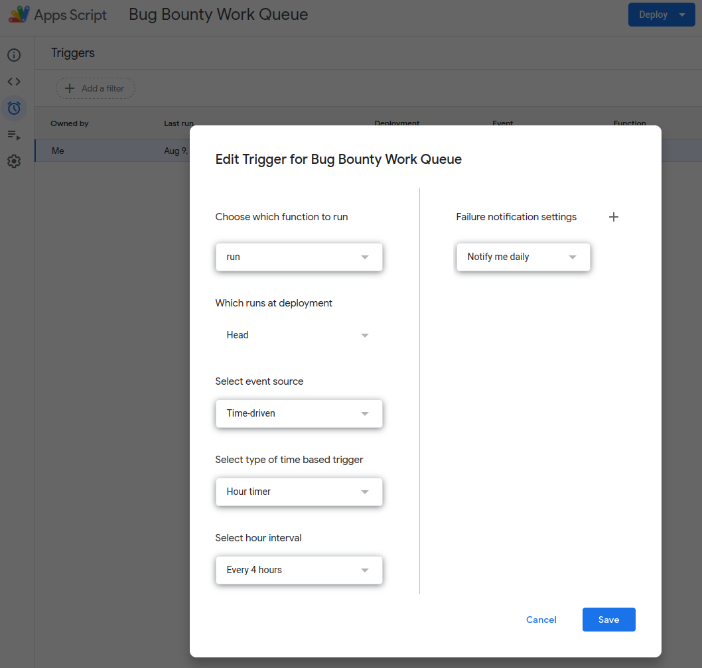

This Google Apps Script tool and library query Mozilla's Bugzilla instance for all `bug-bounty` flagged tickets
and populates the "Bug Bounty Work Queue" Google Spreadsheet with them. This Spreadsheet is used by the Bug Bounty teams
to manage inbound bug bounty reports.

The script is developed by and run under the account of [Tom Ritter](https://people.mozilla.org/p/p--emlnj87qdyrowmx16535e).

* `update-spreadsheet.js` : This is the main script which is triggered to run every 4 hours
  * The deployed instance of this script contains a Tom's Bugzilla API key to be able to query for the tickets
  * This script calls the `doTheNormal` method in `Code.gs.js`
* `bugzilla-syncing-code-library/Code.gs.js` : This is the library that contains all of the syncing logic. This library is used by `update-spreadsheet.js`
  * This library can be found deployed at https://script.google.com/home/projects/1oIChL58TltYGtyXdSDA3ckH9V4ZLY6G5BKsuHm9MlrHDTBt2t_zsGK2O/edit

`update-spreadsheet.js` is triggered by a Google Apps Script trigger

